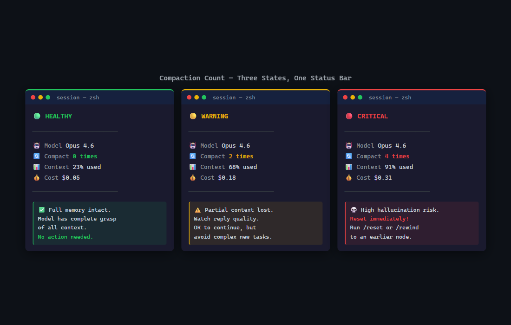

# compact-counter

显示 Claude Code 当前会话的上下文压缩次数。  
运行一次，输出一个数字：0 / 1-2 / 3+。

## 效果



状态栏显示 `压缩:2` 或 `记忆完整`。

## 快速使用

```bash
# 复制脚本到 Claude Code 脚本目录
cp compact-counter.py ~/.claude/scripts/

# 在 ~/.claude/settings.json 中配置 PreCompact、PostCompact、SessionStart 三个 hook
# 完整 hook 配置见 deepseek-claude-code-starter 仓库

# 在 Claude Code 中运行
/run compact-counter
```

## 原理

统计 Claude Code hook 事件中的 compact 次数，持久化到 `~/.claude/compact-state.json`，在状态栏显示。

## 已知局限

- 不会自动刷新，需要手动运行
- 多会话会累加（不自动重置）
- 仅测试过 Windows（macOS/Linux 路径需自行调整）

## License

MIT
